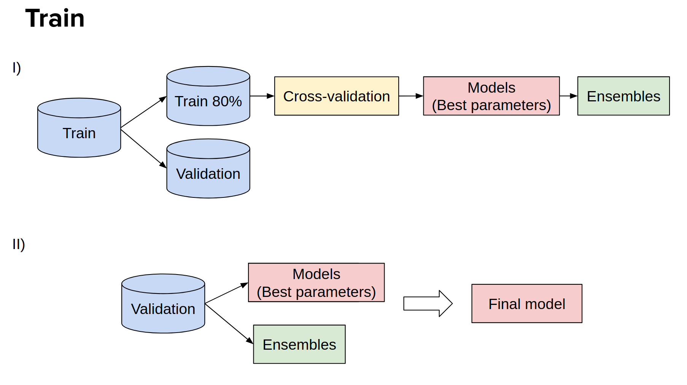

# AI-UPV at IberLEF-2021 EXIST task: Sexism Prediction in Spanish and English Tweets Using Monolingual and Multilingual BERT and Ensemble Models



# Description
This repository contains the code for the paper **Sexism Prediction in Spanish and English Tweets Using Monolingual and Multilingual BERT and Ensemble Models**. This paper was be published at the [SEPLN-WS-IberLEF 2021](http://ceur-ws.org/Vol-2943/
) (the 3rd Workshop on Iberian Languages Evaluation Forum at the SEPLN 2021 Conference) scientific event. Descriptions of the implementation and the dataset are contained in the [paper](http://ceur-ws.org/Vol-2943/exist_paper2.pdf).

# Paper Abstract
The popularity of social media has created problems such as hate speech and sexism. The identification and classification of sexism in social media are very relevant tasks, as they would allow building a healthier social environment. Nevertheless, these tasks are considerably challenging. This work proposes a system to use multilingual and monolingual BERT and data points translation and ensemble strategies for sexism identification and classification in English and Spanish. It was conducted in the context of the sEXism Identification in Social neTworks shared 2021 (EXIST 2021) task, proposed by the Iberian Languages Evaluation Forum (IberLEF). The proposed system and its main components are described, and an in-depth hyperparameters analysis is conducted. The main results observed were: (i) the system obtained better results than the baseline model (multilingual BERT); (ii) ensemble models obtained better results than monolingual models; and (iii) the E6 model (ensemble model considering all individual models and the best standardized values) obtained the best accuracies and F1-scores for both tasks. This work obtained first place in both tasks at EXIST, with the highest accuracies (0.780 for task 1 and 0.658 for task 2) and F1-scores (F1-binary of 0.780 for task 1 and F1-macro of 0.579 for task 2).

# Cite
If you find this [article](http://ceur-ws.org/Vol-2943/exist_paper2.pdf) or the [code](https://github.com/AngelFelipeMP/BERT-tweets-sexims-classification) useful in your research, please cite us as:

```
@article{gonzalo2021iberlef,
  title={Sexism Prediction in Spanish and English Tweets Using Monolingual and Multilingual BERT and Ensemble Models},
  author={de Paula, Angel Felipe Magnoss{\~a}o and da Silva, Roberto Fray and Schlicht, Ipek Baris},
  booktitle={Proceedings of the Iberian Languages Evaluation Forum (IberLEF 2021) co-located with the Conference of the Spanish Society for Natural Language Processing (SEPLN 2021), XXXVII International Conference of the Spanish Society for Natural Language Processing., M{\'a}laga, Spain},
  volume={2943},
  pages={356-373},
  year={2021}
  }
```

```
@article{de2021sexism,
  title={Sexism Prediction in Spanish and English Tweets Using Monolingual and Multilingual BERT and Ensemble Models},
  author={de Paula, Angel Felipe Magnoss{\~a}o and da Silva, Roberto Fray and Schlicht, Ipek Baris},
  journal={arXiv preprint arXiv:2111.04551},
  year={2021}
}
```


# Credits
EXIST 2021 shared Task Organizers

EXIST 2021 proceedings: http://ceur-ws.org/Vol-2943/exist_paper2.pdf

Task website: http://nlp.uned.es/exist2021/

Contact: jcalbornoz@lsi.uned
